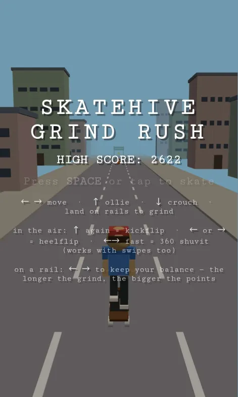
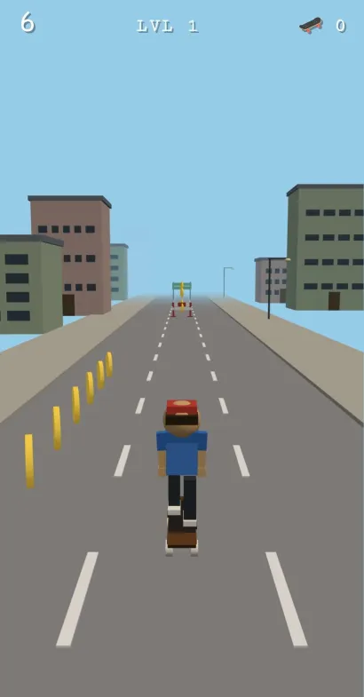
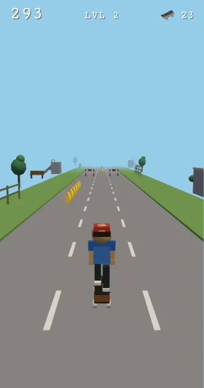
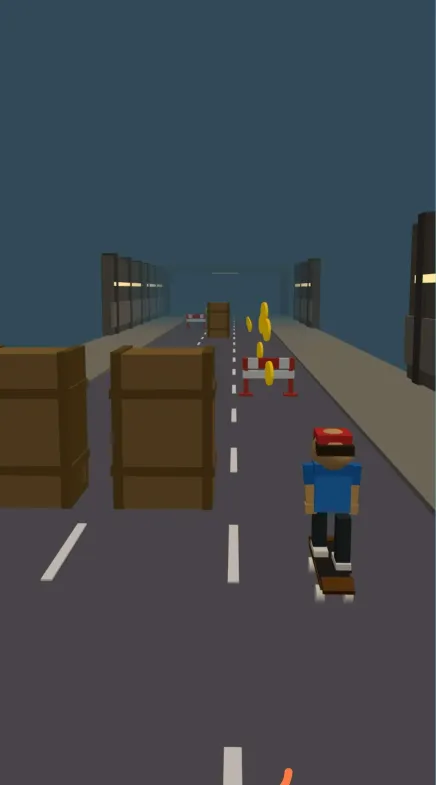

# 🛹 Skatehive GRIND RUSH

An endless skateboarding runner for the browser — dodge, ollie, grind rails, and land tricks as you tour a city, a skatepark, and a subway across morning, sunset, night, and dawn. Inspired by the Chrome dino game and Subway Surfers, built from scratch with **Three.js**. Every model is low-poly geometry generated in code — no textures, no asset files.

Installable as a PWA and fully playable offline.

## Play

```bash
npm install
npm run dev
```

Then open the printed local URL (default http://localhost:5173).

|||
|-|-|
|||
|||


## Controls

| Action | Keyboard | Touch |
|---|---|---|
| Move between lanes | ← → &nbsp;/&nbsp; A D | Swipe left / right |
| Ollie (jump) | ↑ / W / Space | Swipe up / tap |
| Crouch & slide | ↓ / S | Swipe down |
| Start / restart | Space / tap | Tap |

### Tricks (while airborne)

- **Kickflip** (+40) — press jump again in the air
- **Heelflip** (+40) — press a lane direction in the air (you still change lanes)
- **360 Shuvit** (+60) — tap opposite directions quickly (←→ or →←)
- **Trick into grind** (+80 bonus) — land a trick straight onto a rail

Dedicated trick keys (Z / X / C) also work.

### Grinding

Land on a rail while falling to snap into a grind. Once you're on, a **balance bar** appears — the needle drifts on its own and you nudge it back with ← →. Hold your balance and the longer you grind, the faster the points stack. Tip too far and you bail. Jump off to chain into the next rail.

## Scoring

- **Distance** — points accrue continuously with speed
- **Bearings** — ⚙️ collectibles, 10 pts each (arc rows reward a well-timed ollie); they bank across runs and fund continues and the skate shop
- **Tricks** — see above
- **Grinds** — a base rate plus a ramp that grows the longer you stay balanced
- **Momentum** — grinding pumps your speed up, powersliding scrubs it: risk pays, safety costs
- **Powerups** — 🧲 magnet, 🛡 shield, ⭐ double score… and a 🛢 oil-slick power-*down* to dodge

High score is saved to `localStorage`.

## Progression

12 levels = **3 locations** (City → Park → Subway) × **4 daylight phases** (Morning → Sunset → Night → Dawn). The run tours every location in the morning, then repeats the whole tour at each later time of day. Each level is a little longer and a little faster than the last, retheming the sky, fog, lighting, and roadside scenery on the fly — windows and streetlamps glow after dark, and the subway tunnels close the fog in tight. Different locations ban different obstacles (no cars in the skatepark, no traffic in the tunnels).

## How it works

Plain JavaScript ES modules — the only runtime dependency is `three`. The world scrolls toward the camera while the player holds `z = 0`, which avoids float drift on long runs. Obstacles, coins, and scenery are drawn from **object pools** and recycled behind the camera, and every mesh shares module-level geometries and materials, so nothing is allocated during play.

```
src/
├── main.js        Bootstrap: renderer, camera, PWA install prompt, rAF loop
├── game.js        State machine (menu/playing/gameover), scoring, levels, camera
├── config.js      All tunables + generated level themes
├── player.js      Lane/jump/slide/grind/trick state + procedural animation
├── world.js       Leapfrogging road, pooled scenery, lights, fog, theme fades
├── chunks.js      Hand-authored obstacle patterns, tiered spawning, recycling
├── obstacles.js   Obstacle types, collider data, mesh pool
├── coins.js       Bearing pool, placement, spin, pickup checks
├── powerups.js    Weighted powerup pickups (magnet/shield/2×/oil)
├── ledger.js      Wallet, part ownership, pot & leaderboard (swappable backend seam)
├── collision.js   Lane + z-range + height-band resolution (and grind snap)
├── input.js       Keyboard + touch swipe → normalized action queue
├── hud.js         DOM overlays, balance bar, store, toasts, high score
└── meshes.js      Procedural low-poly mesh builders (skater, obstacles, scenery)
```

The skater is a hierarchy of boxes and cylinders; all animation — lane banking, board pitch on jumps, board spins on tricks, the crouch, the boardslide, the game-over tumble — is per-frame transform math derived from state, with no rigged models or animation mixer.

## Scripts

```bash
npm run dev       # Vite dev server with hot reload
npm run build     # Production build to dist/ (includes PWA service worker)
npm run preview   # Serve the production build locally
npm test          # Headless smoke test (tests/smoke.mjs)
```

## Install as an app

The game ships as a PWA (via `vite-plugin-pwa`). On a production build, Chrome/Android shows an **Install App** button on the menu; iOS Safari gets an "Add to Home Screen" hint. Once installed it runs fully offline — the whole build is precached.

## Future development

Game-feel work, in priority order — the theme is making existing systems talk to each
other and to the player's hands, rather than adding new ones:

1. **Input buffering + coyote time** — a jump pressed just before landing fires on
   landing; a jump just after rolling off an edge still counts. Invisible when done
   right, and the #1 fix for "it felt unfair". Biggest feel win available.
2. **Combo multiplier** — chain trick → grind → trick-off-rail without touching flat
   ground to build a multiplier that resets on a plain landing. Turns isolated payouts
   into *lines* you chase (the Tony Hawk insight: the fun isn't the trick, it's the line).
3. **Sound** — rolling rumble, ollie pop, grind screech that pitch-shifts with balance,
   a "ting" per bearing. Audio is half of game feel and even simple WebAudio synthesis
   would transform it.
4. **Near-miss rewards** — points for shaving past an obstacle turn every dodge into a
   micro-decision: cut it close for score, or play it safe.
5. **Session goals** — daily missions ("grind 100 m", "collect 50 bearings in one run")
   with ⚙️ rewards that feed the store economy.

### Economy roadmap

The skate shop, pot, and leaderboard currently run client-side behind the `Ledger`
interface ([src/ledger.js](src/ledger.js)) — deliberately swappable:

- **Phase 2 — backend**: an `ApiLedger` against a server that owns balances, inventory,
  the pot, and the ranked leaderboard, and validates run results (the client is untrusted).
- **Phase 3 — Hive blockchain**: [aioha](https://github.com/aioha-hive/aioha) login links a
  Hive account, `withdraw()` cashes banked bearings out to on-chain tokens, and a weekly
  job settles the pot to the top 3 ranked skaters. Ranked mode already normalizes part
  stats so the prize competition stays pay-to-win-free.
- **Second currency** — a premium "gold" alongside earned bearings for the top-tier gear
  (hoverboard decks), once the token economy is live.

## Tech

- [Three.js](https://threejs.org/) for WebGL rendering
- [Vite](https://vitejs.dev/) for dev/build
- [vite-plugin-pwa](https://vite-pwa-org.netlify.app/) for offline + installability

## License

Part of the [Skatehive](https://skatehive.app) community. Add a `LICENSE` file to set terms (MIT is a common choice for projects like this).
